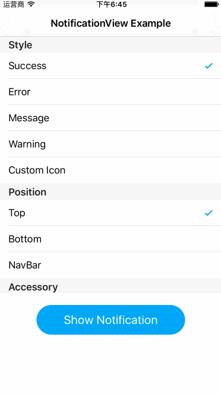

#NotificationView
Easy to use and customizable messages/notifications for iOS applications.



##How To Get Started
###Carthage
Specify "NotificationView" in your ```Cartfile```:
```ogdl 
github "teambition/NotificationView"
```

###Usage
##### Style
Four default icon styles available, and custom icon is supported certainly.
```swift
enum NotificationViewStyle {
    case Success
    case Error
    case Message
    case Warning
    case Custom(UIImage?)
}
```

##### Position
```swift
enum NotificationViewPosition {
    case Top
    case Bottom
    case NavBar(UINavigationController)
}
```
For position ```NavBar```, an UINavigationController instance is needed for displaying the notification.

##### Accessory Type
```swift
enum NotificationViewAccessoryType {
    case None
    case DisclosureIndicator(() -> Void)
    case Custom(UIView)
}
```
For accessory type ```DisclosureIndicator```, a disclosure indicator will be displayed in the right side of the notification, which indicates that tapping the notification triggers an action associated with the value of the ```accessoryType``` property.

For accessory type ```Custom```, the given associated view will be used for the right accessory view of notification.

##### Show Notification
```swift
class func showNotification(position: NotificationView.NotificationViewPosition = default, style: NotificationView.NotificationViewStyle, title: String?, subtitle: String?, accessoryType: NotificationView.NotificationViewAccessoryType = default) { }

class func showSuccess(position: NotificationView.NotificationViewPosition = default, title: String?, subtitle: String?, accessoryType: NotificationView.NotificationViewAccessoryType = default) { }

class func showError(position: NotificationView.NotificationViewPosition = default, title: String?, subtitle: String?, accessoryType: NotificationView.NotificationViewAccessoryType = default) { }

class func showMessage(position: NotificationView.NotificationViewPosition = default, title: String?, subtitle: String?, accessoryType: NotificationView.NotificationViewAccessoryType = default) { }

class func showWarning(position: NotificationView.NotificationViewPosition = default, title: String?, subtitle: String?, accessoryType: NotificationView.NotificationViewAccessoryType = default) { }
```

For position ```NavBar```, there is a convenient way to show notification, you can call these functions of ```UINavigationController```:
```swift
extension UINavigationController {
    func showNotification(style: NotificationView.NotificationViewStyle, title: String?, subtitle: String?, accessoryType: NotificationView.NotificationViewAccessoryType = default)

    func showSuccess(title title: String?, subtitle: String?, accessoryType: NotificationView.NotificationViewAccessoryType = default)

    func showError(title title: String?, subtitle: String?, accessoryType: NotificationView.NotificationViewAccessoryType = default)

    func showMessage(title title: String?, subtitle: String?, accessoryType: NotificationView.NotificationViewAccessoryType = default)

    func showWarning(title title: String?, subtitle: String?, accessoryType: NotificationView.NotificationViewAccessoryType = default)
}
```

#####  Implement the delegate if needed
```swift
func shouldShowNotificationView(notificationView: NotificationView) -> Bool {
    // default is true
}

func willShowNotificationView(notificationView: NotificationView) {
    // do something
}

func didShowNotificationView(notificationView: NotificationView) {
    // do something
}

func shouldDismissNotificationView(notificationView: NotificationView) -> Bool {
    // default is true
}

func willDismissNotificationView(notificationView: NotificationView) {
    // do something
}

func didDismissNotificationView(notificationView: NotificationView) {
    // do something
}
```

## Minimum Requirement
iOS 8.0

## Release Notes
* [Release Notes](https://github.com/teambition/NotificationView/releases)

## License
NotificationView is released under the MIT license. See [LICENSE](https://github.com/teambition/NotificationView/blob/master/LICENSE.md) for details.

## More Info
Have a question? Please [open an issue](https://github.com/teambition/NotificationView/issues/new)!
